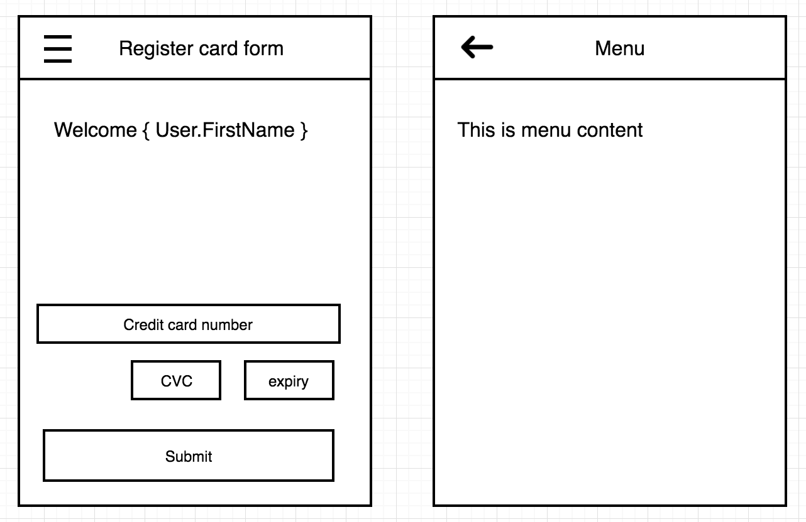

# Assignment

Create a one page application following the LO-FIs given in this assignment.

We have provided the base code to get you started.

## LO-FI

Remember these are LO-FI and should only be treated as such.

## Spec

These are the only functional requirements for your implementation:

### Navigation

-   Click on burger icon shows menu
-   Click on back shows register card form

## Commits

Please commit frequently to communicate your thoughts while working on this assignment.

## What is valued

-   Unit tests
-   Clean Code
-   State Management
-   Design (Responsive)
-   Accessibility

## Duration

Use roughly around an hour on this assignment. Ensure you complete the basic requirements of this assignment but you are welcome to showcase more if you wish.

# Tools & Tech

You can use any tools, plugins and technologies as required for you to complete this assignment on top of what is provided but we expect that you create the UI components without the use of existing component libraries

-   React
-   Typescript
-   SCSS

# Submitting Assignment

Feel free to create a public GitHub repo or private GitHub repo where it's accessible to the assessor
